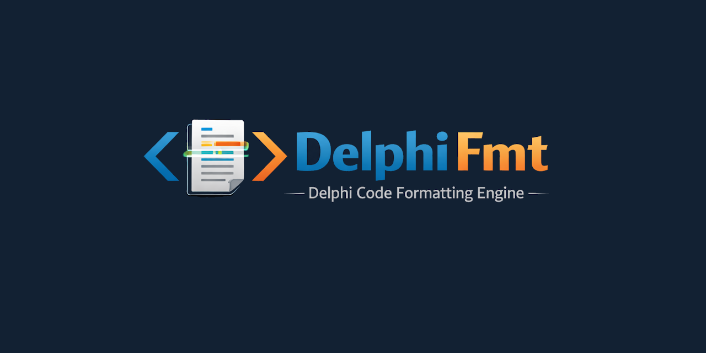

<div align="center">



[](https://discord.gg/Wb6z8Wam7p) [](https://bsky.app/profile/tinybiggames.com)

</div>

## What is DelphiFmt?

**DelphiFmt is a Delphi source code formatter. It reads your code, applies your rules, and writes it back clean.**

DelphiFmt is a Delphi library that formats `.pas`, `.dpr`, `.dpk`, and `.inc` source files according to a fully configurable set of formatting rules. You obtain a default options record, adjust any settings you care about, then call one method. The formatter tokenizes your source using [Parse()](https://github.com/tinyBigGAMES/ParseKit), applies indentation, spacing, line break, capitalisation, and alignment rules, and returns the formatted result. All formatting operations are idempotent — running the formatter on already-formatted source produces identical output.

```pascal
var
  LFmt:     TDelphiFmt;
  LOptions: TDelphiFmtOptions;
  LResults: TArray<TDelphiFmtFormatResult>;
  LResult:  TDelphiFmtFormatResult;
begin
  LFmt := TDelphiFmt.Create();
  try
    LOptions := LFmt.DefaultOptions();

    // Adjust any options you need
    LOptions.LineBreaks.RightMargin                    := 120;
    LOptions.Capitalization.ReservedWordsAndDirectives := capLowerCase;
    LOptions.Spacing.AroundBinaryOperators             := spBeforeAndAfter;

    // Format an entire folder in one call
    LResults := LFmt.FormatFolder('src\', LOptions, True, True);

    for LResult in LResults do
    begin
      if LResult.Success and LResult.Changed then
        WriteLn('Formatted: ', LResult.FilePath)
      else if not LResult.Success then
        WriteLn('Error: ', LResult.ErrorMsg);
    end;
  finally
    LFmt.Free();
  end;
end;
```

## ✨ Key Features

- 🔧 **Fully configurable**: Every formatting decision is controlled through a single `TDelphiFmtOptions` record with over 60 options grouped into five logical categories: indentation, spacing, line breaks, capitalisation, and alignment.
- 🔁 **Idempotent by design**: Running the formatter on already-formatted source produces byte-for-byte identical output. Safe to integrate into CI pipelines, pre-commit hooks, and save-on-format workflows.
- 📂 **Three entry points**: Format a string in memory with `FormatSource`, format a single file with `FormatFile`, or recursively format an entire directory tree with `FormatFolder`. All three share the same options record.
- 💾 **Automatic backups**: `FormatFile` and `FormatFolder` accept a `CreateBackup` flag. When enabled, the original file is written to a `.bak` copy before any changes are applied.
- 🔍 **Change detection**: Every file-level result reports whether the file was actually changed. Unchanged files are never rewritten.
- 🧩 **ParseKit-powered lexer**: Tokenization is handled by [Parse()](https://github.com/tinyBigGAMES/ParseKit), giving the formatter a precise, complete token stream for every Delphi construct.
- 📐 **Indentation control**: 16 independent indentation options covering `begin`/`end`, class bodies, function bodies, nested functions, `case` labels, assembly sections, compiler directives, and continuation lines.
- 🔡 **Capitalisation normalisation**: Reserved words, compiler directives, numeric literals, and all other identifiers can each be independently set to upper case, lower case, as-is, or normalised to match the first occurrence in the file.
- ↔️ **Spacing precision**: Independent control over spacing around colons, commas, semicolons, assignment operators, binary operators, unary operators, parentheses, square brackets, angle brackets, and both line and block comments.
- 📏 **Right margin and line break rules**: Configurable right margin, CRLF/LF/CR line ending choice, maximum adjacent empty lines, and fine-grained control over when line breaks are inserted around `begin`, `then`, `else`, `uses`, `var`, `const`, and anonymous functions.
- ▦ **Vertical alignment**: Optional column-aligned formatting for `=` in constants, type declarations and initialisations, `:=` in consecutive assignments, end-of-line comments, property fields, and parameter type annotations.

## 🎯 Who is DelphiFmt For?

DelphiFmt is for anyone who writes Delphi and wants their source formatted consistently without thinking about it.

- **Individual developers**: Stop adjusting whitespace by hand. Define your style once in a `TDelphiFmtOptions` record and let the formatter enforce it every time.
- **Teams**: Eliminate style debates. Check a shared options configuration into source control and run `FormatFolder` on every commit. Every file, every developer, every time.
- **Tool builders**: Embed DelphiFmt into an IDE plugin, a build script, a language server, or a code review tool. The API is three methods. There is no configuration file format to parse, no process to shell out to, no external binary to ship.
- **CI pipelines**: Add a formatting check to your build. Run `FormatFolder` with `CreateBackup := False`, collect the results, and fail the build if any file reports `Changed = True`. Formatting drift never reaches the main branch.
- **Legacy codebases**: Point `FormatFolder` at a directory tree, pick a style, and reformat years of inconsistently styled code in one pass. The `.bak` backup flag means nothing is lost.

## 🔄 How It Works

DelphiFmt is four source files and [Parse()](https://github.com/tinyBigGAMES/ParseKit):

```
DelphiFmt.Lexer.pas    - keyword and operator registration for the Delphi token set
DelphiFmt.Grammar.pas  - grammar rules describing Delphi syntactic structure
DelphiFmt.Emitter.pas  - formatting output rules applied to each token and construct
DelphiFmt.pas          - public API: TDelphiFmt, TDelphiFmtOptions, TDelphiFmtFormatResult
```

Parse() provides the tokenizer and the token stream infrastructure. DelphiFmt provides the Delphi language definition and all formatting logic.

```
Delphi source
      |
      v
+-----------+  tokens   +----------+   structured   +-------------+
|   Lexer   | --------> |  Grammar | -------------> |   Emitter   |
| (Parse()) |           | (Parse())|   token stream |  (rules)    |
+-----------+           +----------+                +-------------+
                                                           |
                                                           v
                                                   formatted source
```

## 🚀 Getting Started

### Prerequisites: Directory Layout

DelphiFmt requires the [ParseKit](https://github.com/tinyBigGAMES/ParseKit) sources to be present as a **sibling directory** alongside DelphiFmt. The Delphi project references ParseKit's source directly. The required layout is:

```
C:\Dev\                         <- or any root you choose
  ParseKit\                     <- ParseKit repo root (contains src\, bin\, etc.)
  DelphiFmt\                    <- DelphiFmt repo root (contains src\, bin\, etc.)
```

Both repos must share the same parent directory. If they do not, the Delphi project will not compile.

### Step 1: Get ParseKit

**Option 1: [Download ParseKit ZIP](https://github.com/tinyBigGAMES/ParseKit/archive/refs/heads/main.zip)**

**Option 2: Git clone**
```bash
git clone https://github.com/tinyBigGAMES/ParseKit.git
```

Place (or clone) it so the folder structure matches the layout above.

### Step 2: Get DelphiFmt

**Option 1: [Download DelphiFmt ZIP](https://github.com/tinyBigGAMES/DelphiFmt/archive/refs/heads/main.zip)**

**Option 2: Git clone**
```bash
git clone https://github.com/tinyBigGAMES/DelphiFmt.git
```

#### System Requirements

| | Requirement |
|---|---|
| **Host OS** | Windows 10/11 x64 |
| **Delphi** | Delphi 11 Alexandria or later |

### Step 3: Open in Delphi and Build

1. Open `src\DelphiFmt - Delphi Source Code Formatter.groupproj` in Delphi
2. Build all projects in the group (`DelphiFmt`, `Testbed`)
3. Run `Testbed` to verify the formatter is working correctly against the included test sources

### Step 4: Use the API

```pascal
uses
  DelphiFmt;

var
  LFmt:    TDelphiFmt;
  LOptions: TDelphiFmtOptions;
  LResult:  TDelphiFmtFormatResult;
begin
  LFmt := TDelphiFmt.Create();
  try
    // Start from the built-in defaults (Castalia-compatible style)
    LOptions := LFmt.DefaultOptions();

    // Override whatever you need
    LOptions.LineBreaks.RightMargin                    := 120;
    LOptions.Capitalization.ReservedWordsAndDirectives := capLowerCase;

    // Format a single file, creating a .bak backup before writing
    LResult := LFmt.FormatFile('MyUnit.pas', LOptions, True);

    if LResult.Success then
    begin
      if LResult.Changed then
        WriteLn('File was reformatted.')
      else
        WriteLn('File was already correctly formatted.');
    end
    else
      WriteLn('Error: ', LResult.ErrorMsg);
  finally
    LFmt.Free();
  end;
end;
```

## 📖 Option Reference

| Group | Options | Description |
|---|---|---|
| **Indentation** | 16 | `begin`/`end` keywords, class bodies, function bodies, inner functions, `case` labels, assembly sections, compiler directives, continuation indent size, and more |
| **Spacing** | 13 | Colons, commas, semicolons, assignment operators, binary operators, unary operators, parentheses, square brackets, angle brackets, line comments, block comments |
| **Line Breaks** | 30+ | Right margin, line ending characters, `begin`/`then`/`else` break placement, `uses`/`var`/`const` sections, anonymous functions, empty line counts around sections, directives, and visibility modifiers |
| **Capitalisation** | 4 | Reserved words and directives, compiler directives, numeric literals, all other identifiers — each independently set to `capUpperCase`, `capLowerCase`, `capAsIs`, or `capAsFirstOccurrence` |
| **Alignment** | 11 | `=` in constants, type declarations, and initialisations; `:=` in assignments; end-of-line comments; property fields; parameter type annotations; configurable maximum column and unaligned line limits |

All options are fields on a plain `TDelphiFmtOptions` record. There is no registry, no INI file, no XML. Pass the record into any formatting method and the options take effect immediately.

## 🤝 Contributing

DelphiFmt is an open project. Whether you are fixing a bug, improving documentation, adding test cases, or proposing a new formatting option, contributions are welcome.

- **Report bugs**: Open an issue with a minimal reproduction. The smaller the source snippet that triggers the problem, the faster the fix.
- **Suggest features**: Describe the formatting rule you need and why. Features that address real, common formatting patterns get traction fastest.
- **Submit pull requests**: Bug fixes, documentation improvements, new test sources, and well-scoped features are all welcome. Keep changes focused.
- **Add test cases**: The `bin\test\` directory contains unformatted and expected-formatted source pairs. New test files that cover edge cases or language constructs are always valuable.

Join the [Discord](https://discord.gg/Wb6z8Wam7p) to discuss development, ask questions, and share what you are building.

## 💙 Support the Project

DelphiFmt is built in the open. If it saves you time or sparks something useful:

- ⭐ **Star the repo**: it costs nothing and helps others find the project
- 🗣️ **Spread the word**: write a post, mention it in a community you are part of
- 💬 **[Join us on Discord](https://discord.gg/Wb6z8Wam7p)**: share what you are building and help shape what comes next
- 💖 **[Become a sponsor](https://github.com/sponsors/tinyBigGAMES)**: sponsorship directly funds time spent on the formatter, new options, and documentation

## 📄 License

DelphiFmt is licensed under the **Apache License 2.0**. See [LICENSE](https://github.com/tinyBigGAMES/DelphiFmt?tab=readme-ov-file#Apache-2.0-1-ov-file) for details.

Apache 2.0 is a permissive open source license that lets you use, modify, and distribute DelphiFmt freely in both open source and commercial projects. You are not required to release your own source code. You can embed DelphiFmt into a proprietary product, ship it as part of a commercial tool, or integrate it into a closed-source IDE plugin without restriction.

The license includes an explicit patent grant, meaning contributors cannot later assert patent claims against you for using their contributions. Attribution is required — keep the copyright notice and license file in place — but beyond that, DelphiFmt is yours to build with.

## 🔗 Links

- [ParseKit - the toolkit that powers DelphiFmt](https://github.com/tinyBigGAMES/ParseKit)
- [Discord](https://discord.gg/Wb6z8Wam7p)
- [Bluesky](https://bsky.app/profile/tinybiggames.com)
- [tinyBigGAMES](https://tinybiggames.com)

<div align="center">

**DelphiFmt™** - Delphi Source Code Formatter.

Copyright © 2026-present tinyBigGAMES™ LLC
All Rights Reserved.

</div>
